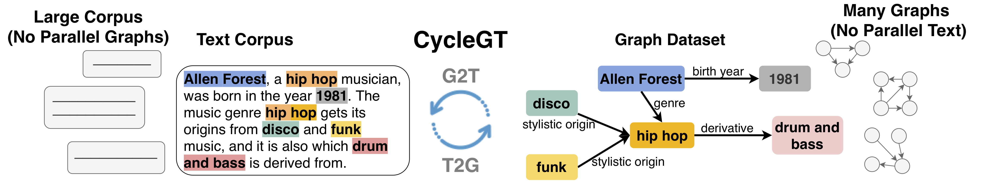

This is the code repository for the paper


&nbsp;&nbsp;&nbsp;&nbsp; **[CycleGT: Unsupervised Graph-to-Text and Text-to-Graph Generation via Cycle Training](https://arxiv.org/pdf/2006.04702.pdf)** 



*Given a text corpus, and a graph dataset, and no parallel (text, graph) pairs, our model CycleGT aims to jointly learn text-to-graph and graph-to-text in a cycle framework.*

### Dependencies
- pytorch 1.4.0 cu10
- `pip install -r requirements.txt`

### How to Run
```
python -u main.py
```

Feel free to change [config.yaml](config.yaml) to set other configurations.


### Results on WebNLG
|Method| BLEU | Micro F1 | Macro F1|
|-|-|-|-|
|Back Translation w/ warmup| 43.08+-0.39| 62.3+-0.2 | 52.1+-0.3|
|Back Translation w/o warmup| 44.97+-0.66| 61.6+-0.2 | 51.4+-0.2|
|Supervised | 44.88+-0.66| 61.0+-0.3| 51.0+-0.3|

### Training on new data  
Preparing the data in json format and replace the file path in the config.yaml  
And there are some constraints:
 - entity mentions, we use the symbol like <ENT_0> to represent an entity in the text, and its surface form should list in the "entities" field.
 - all the nodes in the graph should be mentioned in "entities"
 
For example, 
``` 
{"relations": [[["Abilene", "Regional", "Airport"], "cityServed", ["Abilene", ",", "Texas"]]], 
"text": "<ENT_0> is served by the <ENT_1> .", 
"entities": [["Abilene", ",", "Texas"], ["Abilene", "Regional", "Airport"]]}
```
BTW, we don't tokenize the text, so make sure that the entity and text have been tokenized.

## Citing CycleGT

If you use CycleGT, please cite **[CycleGT: Unsupervised Graph-to-Text and Text-to-Graph Generation via Cycle Training](https://arxiv.org/pdf/2006.04702.pdf)**.

```bibtex
@article{guo2020cyclegt,
  author    = {Qipeng Guo and Zhijing Jin and Xipeng Qiu and Weinan Zhang and David Wipf and Zheng Zhang},
  title     = {CycleGT: Unsupervised Graph-to-Text and Text-to-Graph Generation via Cycle Training},
  journal   = {CoRR},
  volume    = {abs/2006.04702},
  year      = {2020},
  url       = {https://arxiv.org/abs/2006.04702},
  archivePrefix = {arXiv},
  eprint    = {2006.04702}
}
```
